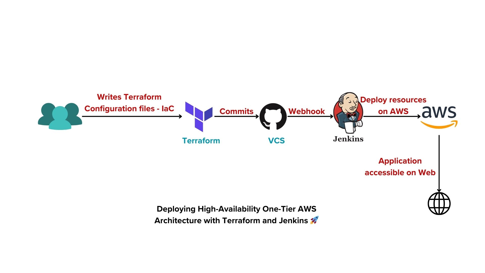

# Deploying High-Availability One-Tier AWS Architecture with Terraform and Jenkins 🚀

## Project Description 📄

This project automates the deployment of a high-availability AWS architecture using Terraform and Jenkins. The architecture consists of an Auto Scaling Group and an Application Load Balancer, all deployed within a separate VPC.

The project is divided into two parts:

- **Part 1:** Committing Terraform configuration code **HCL** in GitHub.
- **Part 2:** Deploying the application to the AWS infrastructure using Jenkins through the **HCL** code in GitHub.

## Architecture Diagram 📌

## Workflow Diagram 📊

## Features 📋

- **High Availability:** The architecture is deployed across multiple Availability Zones to ensure high availability.

- **Auto Scaling:** The Auto Scaling Group ensures that the desired number of EC2 instances are always running.

- **Load Balancing:** The Application Load Balancer distributes incoming traffic across the EC2 instances.

- **Security:** The EC2 instances are deployed within a private subnet and are not directly accessible from the Internet. The Application Load Balancer is deployed within a public subnet and is accessible from the Internet.

- **Infrastructure as Code:** The AWS infrastructure is deployed using Terraform.

- **Continuous Integration:** The application is deployed to the AWS infrastructure using Jenkins.

- **Continuous Delivery:** The application is deployed to the AWS infrastructure automatically whenever a change is made to the application code.

- **Self-Healing:** The Auto Scaling Group is configured to replace unhealthy EC2 instances.

- **Highly Available Architecture:** The architecture is deployed across multiple Availability Zones to ensure high availability.

## Tools and Technologies Used 🛠️

- **AWS:** Amazon Web Services (AWS) is a subsidiary of Amazon providing on-demand cloud computing platforms and APIs to individuals, companies, and governments, on a metered pay-as-you-go basis.

- **Terraform:** Terraform is an open-source infrastructure as code software tool created by HashiCorp. Users define and provision data center infrastructure using a declarative configuration language known as HashiCorp Configuration Language (HCL), or optionally JSON.

- **Jenkins:** Jenkins is a free and open source automation server. Jenkins helps to automate the non-human part of the software development process, with continuous integration and facilitating technical aspects of continuous delivery.

## Prerequisites 📋

Before you begin, ensure you have the following:

- An AWS account with appropriate permissions to create resources.
- Terraform installed on your local machine or Jenkins server.
- Jenkins installed and configured for your CI/CD pipeline.

## Steps 📐

- Follow the Steps below to getting started with deploying the AWS infrastructure using Terraform and Jenkins.

| Step No | Document Link |
| ------ | ------ |
| 1 | [Configuring Jenkins][Step-1] |
| 2 | [Installation and Configuration of Plugins][Step-2] |
| 3 | [Terraform Configuration files][Step-3] |
| 4 | [Storing AWS Credetials][Step-4] |
| 5 | [Configure Pipeline Job][Step-5] |
| 6 | [Deploy Resources][Step-6] |
| 7 | [Configuring Webhook][Step-7] |

   [Step-1]: <./Steps/configure.d>
   [Step-2]: <./Steps/plugins.md>   
   [Step-3]: <./Steps/terraform-configuration.md>
   [Step-4]: <./Steps/credentials.md>
   [Step-5]: <./Steps/configure-pipeline.md>  
   [Step-6]: <./Steps/deploy.md>
   [Step-7]: <./Steps/webhook.md>

## Usage ⚙️

- Clone the repository to your local machine or Jenkins server.

- Create a new pipeline job in Jenkins and configure it to use the `Jenkinsfile` in the repository.

- Run the pipeline job and choose deploy to deploy the AWS infrastructure.

- Run the pipeline job and choose destroy to destroy the Created infrastructure.

## Contributing 🤝

Pull requests are welcome. For major changes, please open an issue first to discuss what you would like to change.

## Aknowledgements 🙏

- [AWS](https://aws.amazon.com/) - For hosting the application.

- [Terraform](https://www.terraform.io/) - For deploying the AWS infrastructure.

- [Jenkins](https://www.jenkins.io/) - For continuous integration and continuous delivery.

  ## Author ✍️

- Follow me [Emayan](https://www.linkedin.com/in/emayan-vadivel/) on LinkedIn.

